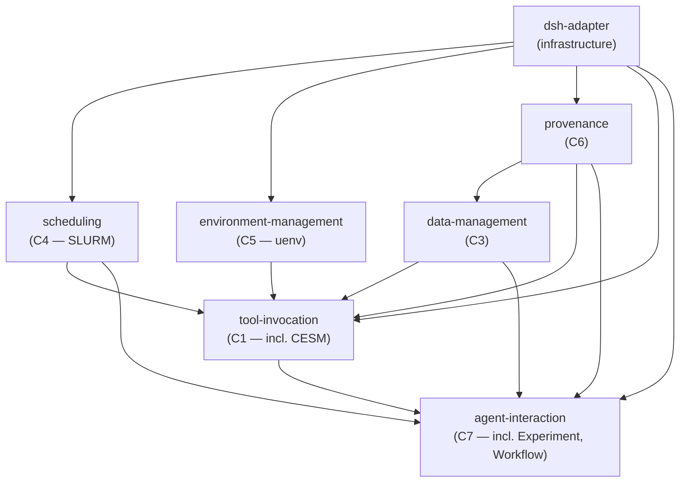

# Dependency Graph — cera

> Derived from `module-graph.md`. All edges are justified with spec
> references. The graph is **acyclic**.

---

## Mermaid Graph



> **Note:** In the graph above, arrows point from dependency to
> dependent (A → B means "B depends on A"). This matches the
> topological ordering: leaf modules appear at the top, dependents
> below.

---

## ASCII Representation

```
Phase 1:  dsh-adapter
             |
             +---> scheduling (Phase 2)
             +---> environment-management (Phase 2)
             +---> provenance (Phase 2)
                       |
                       +---> data-management (Phase 3)
                                  |
             +--------------------+
             |                    |
             v                    v
Phase 4:  scheduling -----> tool-invocation
          env-mgmt ------>/
          data-mgmt ----->/
          provenance ---->/
          dsh-adapter --->/
                               |
                               v
Phase 5:  tool-invocation --> agent-interaction
          data-mgmt ----------/
          provenance --------/
          scheduling --------/
          dsh-adapter ------/
```

---

## Edge Annotations

Each edge lists the dependency and the spec reference that justifies it.

### Phase 1 → Phase 2

| Edge | Dependency | Justification |
|------|------------|---------------|
| `dsh-adapter → scheduling` | scheduling wraps SLURM CLI via `ctx.subprocess` and `ctx.jobs` | `module-graph.md` §2; `assumptions.md` A1 (dsh isolation layer) |
| `dsh-adapter → environment-management` | env-mgmt wraps uenv CLI via `ctx.subprocess` and `ctx.fs` | `module-graph.md` §3; `assumptions.md` A1; `resolutions.md` R9 (uenv mount-based) |
| `dsh-adapter → provenance` | provenance persists records via `ctx.fs` | `module-graph.md` §4; `assumptions.md` A1 |

### Phase 2 → Phase 3

| Edge | Dependency | Justification |
|------|------------|---------------|
| `provenance → data-management` | A Dataset is not consumable until its ProvenanceRecord exists | `cross-context/interactions.md` X7 (C3↔C6); `invariants.md` INV-D3, INV-P3 |

### Phase 2/3 → Phase 4

| Edge | Dependency | Justification |
|------|------------|---------------|
| `environment-management → tool-invocation` | ToolInvocation requires Environment loaded and verified before execution | `cross-context/interactions.md` X1 (C1↔C5); `invariants.md` INV-T1, INV-E2 |
| `data-management → tool-invocation` | Tools consume and produce Datasets; output registration gated on success | `cross-context/interactions.md` X3 (C1↔C3); `invariants.md` INV-T3, INV-D4 |
| `provenance → tool-invocation` | Every ToolInvocation produces a ProvenanceRecord before output is registered | `cross-context/interactions.md` X4 (C1↔C6); `invariants.md` INV-T3, INV-P2 |
| `scheduling → tool-invocation` | Parallel tools (incl. CESM) delegate to Scheduling; CESM case.submit creates a Job | `cross-context/interactions.md` X2 (C1↔C4), X5 (subsumed); `invariants.md` INV-S1, INV-T6–T9 |
| `dsh-adapter → tool-invocation` | Tool execution via `ctx.shell`, `ctx.subprocess`, `ctx.sandbox` | `module-graph.md` §6; `assumptions.md` A1 |

### Phase 4/5 → Phase 5

| Edge | Dependency | Justification |
|------|------------|---------------|
| `tool-invocation → agent-interaction` | Agent translates User intent into ToolInvocations (incl. CESM Cases) | `cross-context/interactions.md` X10 (C7↔C1), X11 (subsumed); `resolutions.md` R1, R12 |
| `data-management → agent-interaction` | Agent queries, references, and registers Datasets | `cross-context/interactions.md` X12 (C7↔C3) |
| `provenance → agent-interaction` | Agent queries ProvenanceRecords on behalf of User | `cross-context/interactions.md` X13 (C6↔C7); `invariants.md` INV-P4 |
| `scheduling → agent-interaction` | Session outlives Jobs; proactive Job reporting on Session start | `cross-context/interactions.md` X8 (C4↔C7); `resolutions.md` R7; `invariants.md` INV-W4 |
| `dsh-adapter → agent-interaction` | Action registration via `ctx.tools`; human commands via `ctx.commands` | `module-graph.md` §7; `assumptions.md` A1 |

---

## Acyclicity Verification

Topological order (phases):

```
Phase 1: dsh-adapter         (no internal deps)
Phase 2: scheduling          (deps: dsh-adapter)
         environment-management (deps: dsh-adapter)
         provenance           (deps: dsh-adapter)
Phase 3: data-management     (deps: provenance, dsh-adapter)
Phase 4: tool-invocation     (deps: env-mgmt, data-mgmt, provenance, scheduling, dsh-adapter)
Phase 5: agent-interaction   (deps: tool-invocation, data-mgmt, provenance, scheduling, dsh-adapter)
```

Every dependency points to a strictly earlier phase. **No cycles.**

---

## Cross-Context Interaction Flow (after R1)

```
                           ┌──────────────────────────────┐
                           │       C7 Agent Interaction    │
                           │  (Session, Experiment,        │
                           │   Workflow, Action)           │
                           └──────┬───────┬───────┬────────┘
                                  │X10    │X12    │X13
                                  v       v       v
    ┌──────────────┐    X1    ┌──────────────────┐  X4   ┌──────────────┐
    │     C5       │◄────────►│      C1          │──────►│     C6       │
    │ Environment  │          │ Tool Invocation  │       │ Provenance   │
    │ (uenv)       │          │ (incl. CESM)     │       │              │
    └──────────────┘          └───────┬──────────┘       └──────▲───────┘
                                      │X2                      │X7
                                      v                        │
    ┌──────────────┐          ┌──────────────────┐             │
    │     C4       │◄────────►│      C1          │             │
    │ Scheduling   │   X8     │ (via C7)         │     ┌───────┴───────┐
    │ (SLURM)      │◄────────►│                  │     │      C3       │
    └──────────────┘          └───────┬──────────┘────►│ Data Mgmt     │
                                      │X3              └───────────────┘
                                      v
                              ┌──────────────────┐
                              │      C3          │
                              │ Data Management  │
                              └──────────────────┘
```

**Interaction legend (after R1 collapse):**

- **X1**: C1↔C5 — Tool requires Environment; load+verify before
  invocation (subsumes X9: CESM env requirements, X14: binary
  availability check)
- **X2**: C1↔C4 — Parallel tool delegates to Scheduling (subsumes
  X5: CESM case.submit creates Job)
- **X3**: C1↔C3 — Tools consume/produce Datasets (subsumes X6: CESM
  output tree becomes Datasets)
- **X4**: C1→C6 — Every ToolInvocation produces a ProvenanceRecord
- **X7**: C3↔C6 — Dataset not consumable until ProvenanceRecord exists
- **X8**: C4↔C7 — Session outlives Jobs; proactive Job reporting on
  Session start
- **X10**: C7↔C1 — Agent translates intent into ToolInvocations
  (subsumes X11: CESM Case lifecycle)
- **X12**: C7↔C3 — Agent queries, references, registers Datasets
- **X13**: C6↔C7 — Agent queries ProvenanceRecords on behalf of User
